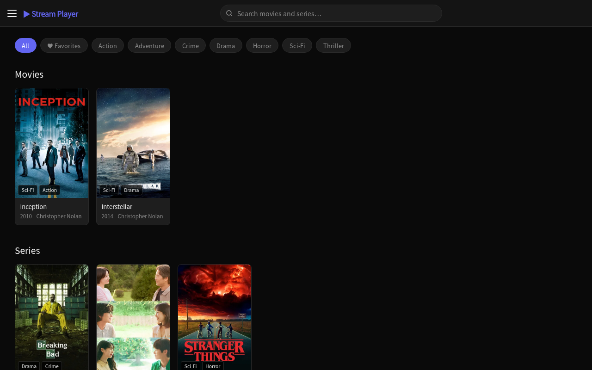
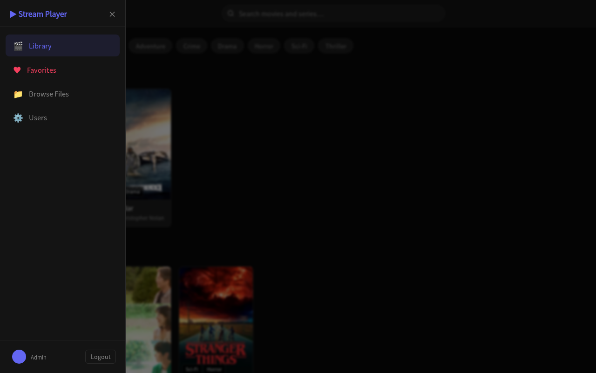
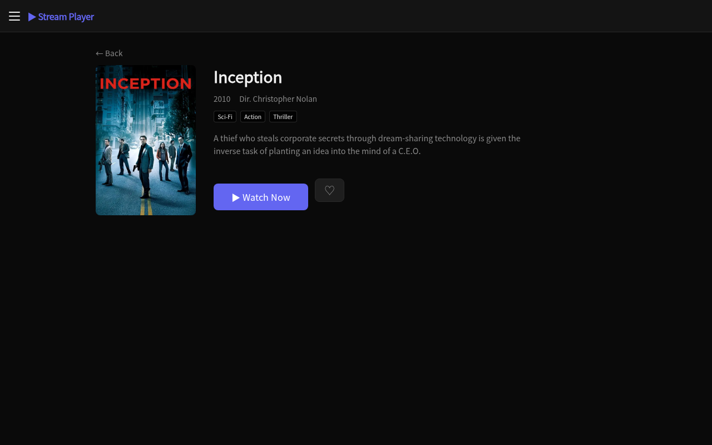
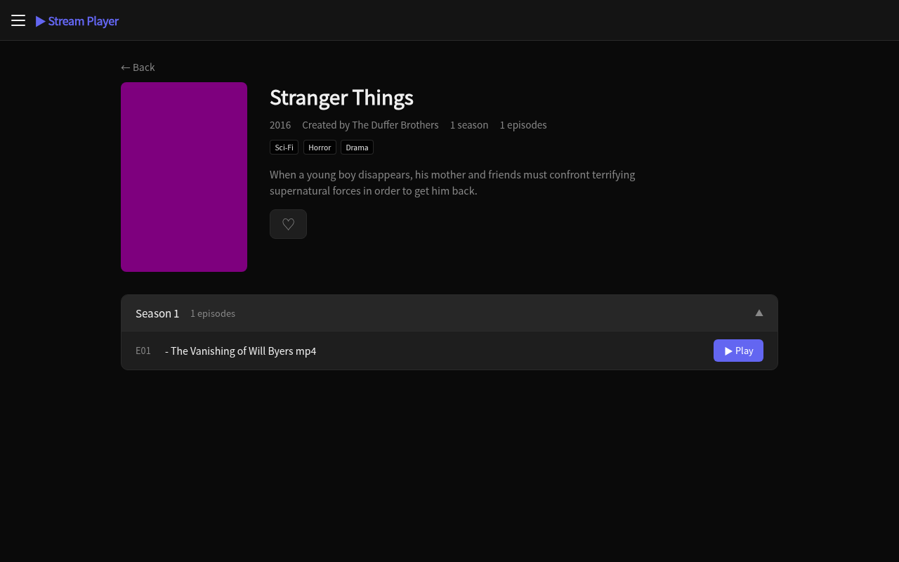
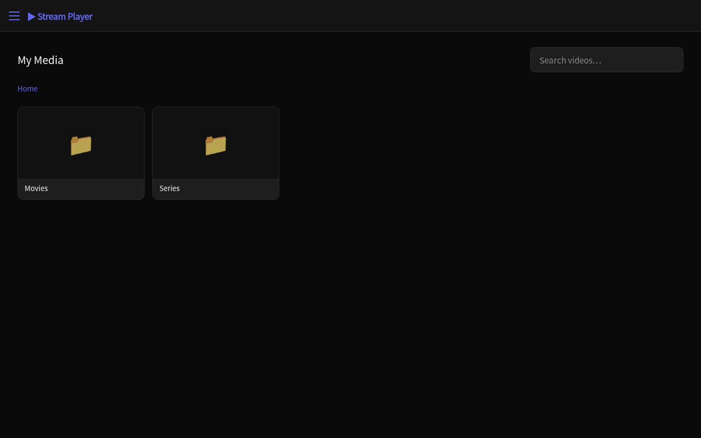
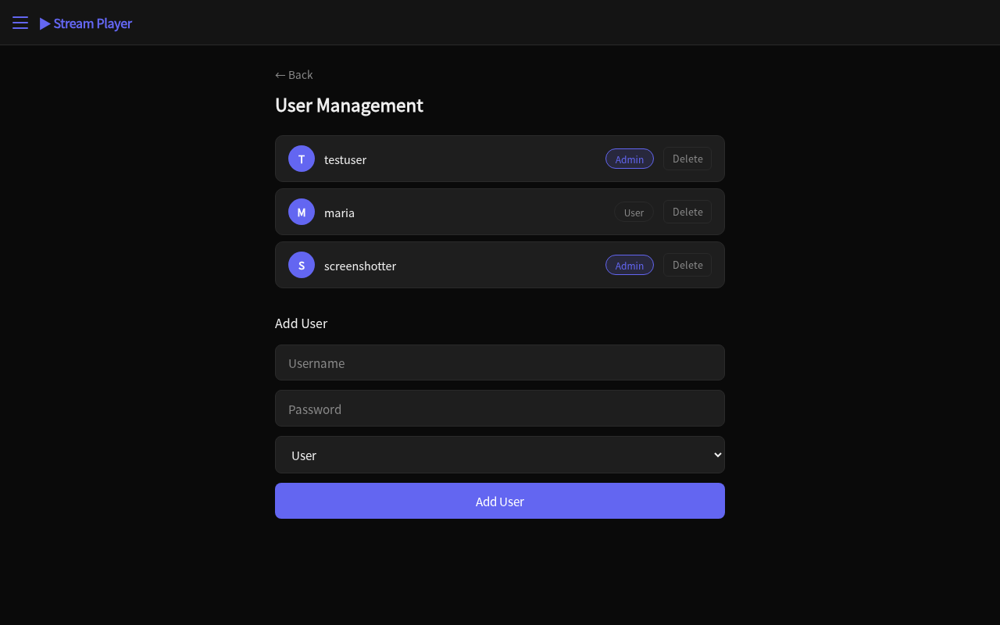
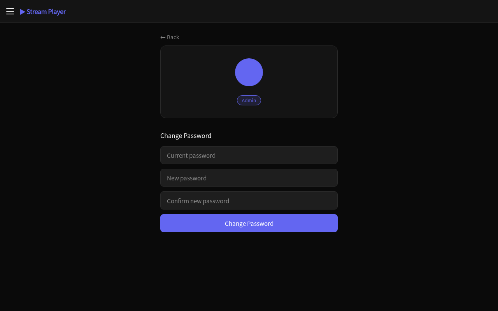
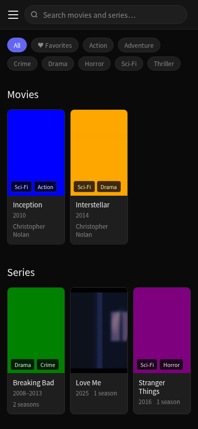

# StreamPlayer

A self-hosted personal streaming platform built with React + Vite (frontend) and Node.js + Express (backend). Designed to run on your own server and stream your local media library from any device.

---

## Features

### Library
- **Movies & Series** organized in separate sections
- **Poster / cover art** — priority order: local `poster.jpg` → TMDB API → ffmpeg thumbnail fallback
- **TMDB integration** — when no local poster exists, the server automatically fetches the official artwork from [The Movie Database](https://www.themoviedb.org/) and caches the result locally
- **Genre filtering** via chip bar — click a genre to filter both movies and series
- **Global search** in the navbar — searches across titles in real time, URL-based (shareable links)
- **Continue Watching** — tracks playback progress per user, resumes exactly where you left off; remove individual items with ✕
- **Favorites** — mark any movie or series with ♥, filter by favorites via chip or burger menu

### Movie & Series Detail pages
- Hero layout: poster (2∶3) + full metadata
- **Movies**: title, year, runtime, director, cast, genres, description → "▶ Watch Now" button
- **Series**: title, year range, creator, runtime per episode, season/episode count, cast, genres, description → season accordion with episode rows
- Episodes show CC badge when subtitles are available
- ♥ favorite button on both detail pages synced with the library

### Video Player
- **HTTP Range Requests** — full seeking support for large files
- Custom controls: play/pause, progress bar, volume, mute, fullscreen
- **Subtitle support**:
  - Sidecar files: `.srt`, `.vtt`, `.ass` (auto-converted to WebVTT)
  - **Embedded MKV streams**: detected via `ffprobe`, extracted on demand via `ffmpeg`
  - CC button opens track selector dropdown
- Token-authenticated stream URLs (works with `<video src>` and `<track src>`)
- Progress saved every 10 s and on pause/unmount; resumes on next play

### Browse Files
- Full file browser starting from `MEDIA_ROOT`
- 16∶9 thumbnails generated by `ffmpeg` (cached in `/tmp/stream-player-thumbs/`)
- Click any video file to play it directly
- Breadcrumb navigation, inline search

### Multi-user
- **JWT authentication** (7-day expiry, bcrypt rounds = 12)
- **Roles**: `admin` and `user`
- Each user's Continue Watching and Favorites are stored separately in `localStorage` (namespaced by username)
- **Profile page**: avatar, role badge, change-password form
- **Admin panel** (`/admin`): list users, add users (username / password / role), delete users — protected routes visible only to admins
- Burger menu shows **Users** link only for admins

### UI / UX
- Dark theme with CSS variables
- Slide-in **burger navigation menu** with overlay and keyboard (Esc) support
- Fully **responsive** — tested at 1280 px, 390 px (iPhone 14), 360 px
  - Hero sections stack vertically on mobile
  - Volume slider hidden on mobile (use device controls)
  - Progress / favorite buttons always visible on touch devices

---

## Screenshots

### Library


### Navigation Menu


### Movie Detail


### Series Detail


### Browse Files


### Admin Panel


### Profile


### Mobile


---

## Tech Stack

| Layer | Technology |
|---|---|
| Frontend | React 18, Vite 5, React Router 6 |
| Backend | Node.js, Express 4 (CommonJS) |
| Auth | JWT (`jsonwebtoken`), bcrypt (`bcryptjs`) |
| Media | ffmpeg (thumbnails, subtitle extraction), ffprobe (stream detection) |
| Subtitles | SRT → WebVTT (regex), ASS → WebVTT (ffmpeg), embedded MKV via `ffmpeg pipe:1` |
| Poster art | TMDB API (auto-fetch + disk cache) with local file and ffmpeg fallback |
| Storage | `users.json` (flat file), `localStorage` per user (progress, favorites) |

---

## Project Structure

```
StreamPlayer/
├── index.html
├── vite.config.js
├── package.json
│
├── src/                        # React frontend
│   ├── main.jsx
│   ├── App.jsx
│   ├── index.css
│   ├── context/
│   │   └── AuthContext.jsx     # token, username, role
│   ├── components/
│   │   ├── Navbar.jsx          # sticky navbar with global search
│   │   ├── BurgerMenu.jsx      # slide-in side navigation
│   │   ├── MediaCard.jsx       # 2:3 poster card (movies & series)
│   │   ├── FileCard.jsx        # 16:9 thumbnail card (file browser)
│   │   ├── VideoPlayer.jsx     # custom HTML5 player
│   │   └── PrivateRoute.jsx
│   ├── pages/
│   │   ├── Login.jsx
│   │   ├── Library.jsx         # home: continue watching + favorites + grid
│   │   ├── MovieDetail.jsx
│   │   ├── SeriesDetail.jsx
│   │   ├── Player.jsx
│   │   ├── Browse.jsx
│   │   ├── Profile.jsx
│   │   └── Admin.jsx
│   └── utils/
│       ├── progress.js         # continue watching (localStorage, per user)
│       ├── favorites.js        # favorites (localStorage, per user)
│       └── poster.js           # buildPosterSrc — handles internal vs TMDB URLs
│
├── server/                     # Express backend
│   ├── index.js
│   ├── config.js               # PORT, JWT_SECRET, MEDIA_ROOT, TMDB_API_KEY
│   ├── tmdb.js                 # TMDB poster lookup with disk cache
│   ├── users.json              # user store (username, hashed password, role)
│   ├── add-user.js             # CLI helper to add/update users
│   ├── .env.example
│   ├── middleware/
│   │   ├── auth.js             # Bearer token — API routes
│   │   ├── streamAuth.js       # Bearer OR ?token= — media elements
│   │   └── adminAuth.js        # admin-only routes
│   └── routes/
│       ├── auth.js             # POST /login, PUT /password
│       ├── users.js            # CRUD users (admin)
│       ├── library.js          # GET /api/library
│       ├── stream.js           # GET /api/stream (Range requests)
│       ├── thumbnail.js        # GET /api/thumbnail (ffmpeg, cached)
│       ├── subtitles.js        # GET /api/subtitles, /api/subtitles/file
│       ├── poster.js           # GET /api/poster
│       └── files.js            # GET /api/files (file browser)
│
└── media/                      # your media files (not committed)
    ├── Movies/
    │   └── Inception/
    │       ├── Inception.mp4
    │       ├── poster.jpg
    │       └── metadata.json
    └── Series/
        └── Breaking Bad/
            ├── Season 1/
            │   ├── S01E01.mkv
            │   └── S01E02.mkv
            ├── poster.jpg
            └── metadata.json
```

---

## Installation

### Prerequisites
- Node.js 18+
- ffmpeg and ffprobe installed and available in `PATH`

### 1. Clone and install

```bash
git clone https://github.com/GhostFTP/StreamPlayer.git
cd StreamPlayer

# Frontend dependencies
npm install

# Backend dependencies
cd server && npm install && cd ..
```

### 2. Configure the server

```bash
cp server/.env.example server/.env
```

Edit `server/.env`:

```env
PORT=3001
JWT_SECRET=replace-with-a-long-random-secret
MEDIA_ROOT=/absolute/path/to/your/media
CLIENT_ORIGIN=http://localhost:5173
NODE_ENV=development
TMDB_API_KEY=your_tmdb_api_key_here
```

> **TMDB API key** (optional but recommended): register at [themoviedb.org](https://www.themoviedb.org/signup), go to **Settings → API → Create → Developer** and copy the v3 key. Without it the server falls back to ffmpeg-generated thumbnails.

### 3. Add the first user

```bash
cd server
node add-user.js
```

Or directly from Node:

```bash
node -e "
const bcrypt = require('bcryptjs');
const fs = require('fs');
bcrypt.hash('yourpassword', 12).then(hash => {
  const users = JSON.parse(fs.readFileSync('users.json', 'utf8'));
  users.push({ username: 'admin', password: hash, role: 'admin' });
  fs.writeFileSync('users.json', JSON.stringify(users, null, 2));
  console.log('User created');
});
"
```

### 4. Run in development

```bash
# Terminal 1 — backend
cd server && node index.js

# Terminal 2 — frontend
npm run dev
```

Open [http://localhost:5173](http://localhost:5173)

### 5. Build for production

```bash
npm run build          # outputs to dist/
NODE_ENV=production cd server && node index.js
```

In production mode the Express server serves the built frontend from `../dist` and the API from `/api/*`.

---

## Media Structure

### Movies

Place each movie in its own folder inside `media/Movies/`:

```
media/Movies/Inception/
├── Inception.mkv        # or .mp4, .avi, etc.
├── poster.jpg           # optional — fetched from TMDB automatically if missing
└── metadata.json        # optional metadata
```

`metadata.json` for a movie:

```json
{
  "title": "Inception",
  "year": 2010,
  "director": "Christopher Nolan",
  "runtime": 148,
  "cast": ["Leonardo DiCaprio", "Joseph Gordon-Levitt", "Elliot Page"],
  "genres": ["Sci-Fi", "Action", "Thriller"],
  "description": "A thief who steals corporate secrets through dream-sharing technology..."
}
```

### Series

Place each series in its own folder inside `media/Series/`. Episodes can be in season subfolders or flat:

```
media/Series/Breaking Bad/
├── Season 1/
│   ├── Breaking.Bad.S01E01.Pilot.mkv
│   └── Breaking.Bad.S01E02.mkv
├── Season 2/
│   └── Breaking.Bad.S02E01.mkv
├── poster.jpg           # optional — fetched from TMDB automatically if missing
└── metadata.json
```

`metadata.json` for a series:

```json
{
  "title": "Breaking Bad",
  "year": 2008,
  "endYear": 2013,
  "creator": "Vince Gilligan",
  "runtime": 47,
  "cast": ["Bryan Cranston", "Aaron Paul", "Anna Gunn"],
  "genres": ["Crime", "Drama", "Thriller"],
  "description": "A high school chemistry teacher..."
}
```

Episode filenames are parsed automatically. Supported patterns: `S01E01`, `s01e01`, `1x01`. Release tags like `1080p`, `WEB-DL`, `NF`, `x265`, etc. are stripped from episode titles.

### Subtitles

**Sidecar files** — place next to the video with the same base name:
```
Movie.mkv
Movie.en.srt
Movie.es.vtt
Movie.fr.ass
```

**Embedded streams** — MKV files with embedded subtitle tracks are detected automatically via `ffprobe`. All streams appear in the CC selector.

---

## API Reference

| Method | Endpoint | Auth | Description |
|---|---|---|---|
| POST | `/api/auth/login` | — | Login, returns JWT + role |
| PUT | `/api/auth/password` | user | Change own password |
| GET | `/api/users` | admin | List all users |
| POST | `/api/users` | admin | Create user |
| DELETE | `/api/users/:username` | admin | Delete user |
| GET | `/api/library` | user | Full library (movies + series + genres) |
| GET | `/api/stream?path=` | stream | Video stream (Range requests) |
| GET | `/api/thumbnail?path=` | stream | Video thumbnail (ffmpeg, cached) |
| GET | `/api/poster?path=` | stream | Serve poster/cover image |
| GET | `/api/subtitles?path=` | user | List subtitle tracks for a video |
| GET | `/api/subtitles/file?path=&stream=` | stream | Serve/extract subtitle as WebVTT |
| GET | `/api/files?path=` | user | Browse files |

Stream auth accepts both `Authorization: Bearer <token>` header and `?token=` query param (required for `<video src>`, ``, `<track src>`).

---

## Environment Variables

| Variable | Default | Description |
|---|---|---|
| `PORT` | `3001` | Express server port |
| `JWT_SECRET` | `dev-secret-change-me` | Secret for JWT signing — **change this** |
| `MEDIA_ROOT` | `../media` | Absolute path to your media library |
| `CLIENT_ORIGIN` | `http://localhost:5173` | CORS allowed origin |
| `NODE_ENV` | `development` | Set to `production` to serve built frontend |
| `TMDB_API_KEY` | `null` | [TMDB](https://www.themoviedb.org/) v3 API key for automatic poster art |

---

## User Management

Users are stored in `server/users.json`. The admin panel at `/admin` (visible only to admin users) allows you to:

- View all users and their roles
- Add new users with username, password, and role (`admin` or `user`)
- Delete users (cannot delete yourself or the last admin)

Each user can change their own password from their profile page (`/profile`).

**Roles:**
- `user` — can browse and stream media
- `admin` — all of the above + access to user management panel

---

## Per-User Data

All user-specific data is stored in `localStorage`, namespaced by username:

| Key | Content |
|---|---|
| `sp_progress_<username>` | Continue Watching (up to 20 entries, auto-removed at 92% watched) |
| `sp_favorites_<username>` | Favorite movie/series IDs |

This means multiple users on the same device/browser have completely separate watch history and favorites.

---

## License

MIT
